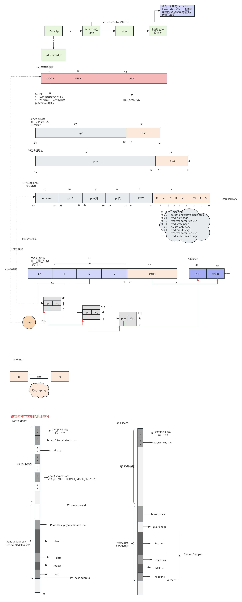

#### 总结
地址空间映射这一章知识密度较高，反复看了几遍才基本弄懂，调试代码陆陆续续调试了3天。(还是太菜，菜就多练！)
简单总结下本章：在开启分页SV39分页之前，OS和都是直接访问物理地址，这给系统带来很多潜在的安全隐患，例如地址空间未隔离等。开启分页模式后，OS和用户代码中就都是虚拟地址了，需要通过页表和MMU进行转换，并且页表上的属性区分出了U和S，进行了权限和空间的隔离，分别在特权级和地址空间上保证了OS内核的安全，同时也保证了用户程序之间相互隔离，彼此空间不会重叠。(虚拟空间可以重叠，但通过页表映射后通常是隔离的，有种特殊情况是通过映射到相同的物理也实现内存共享)

另外为了OS在开启分页后能平滑的访问，对于OS采用的是恒等映射(虚拟页号=物理页帧)。而对于用户程序通常采用Framed映射，通过栈式页帧分配器分配页帧并和虚拟页号建立映射关系，动态生成页表及页表项，实现物理页帧的按需分配。

另外一个比较好的抽象是地址空间MemorySet，它作为任务的一部分，管理着页表及和逻辑区。在实现采用了RAIL机制，加上rust的所有权及drop trait自动实现页表项的释放。

#### 第一题
最低的位则是标志位，它们的含义如下：
仅当 V(Valid) 位为 1 时，页表项才是合法的；
R/W/X 分别控制索引到这个页表项的对应虚拟页面是否允许读/写/取指；
U 控制索引到这个页表项的对应虚拟页面是否在 CPU 处于 U 特权级的情况下是否被允许访问；
G 全局页表项。这意味着即使是在上下文切换（例如，进程切换）之后，该页表项也不会被冲洗（flushed）或失效。简而言之，G位用于指示页表项在地址空间的多个上下文中保持有效。
A(Accessed) 记录自从页表项上的这一位被清零之后，页表项的对应虚拟页面是否被访问过；
D(Dirty) 则记录自从页表项上的这一位被清零之后，页表项的对应虚拟页表是否被修改过。

#### 第二题

#### 荣誉准则

1. 在完成本次实验的过程（含此前学习的过程）中，我曾分别与 以下各位 就（与本次实验相关的）以下方面做过交流，还在代码中对应的位置以注释形式记录了具体的交流对象及内容：
   无

2. 此外，我也参考了 以下资料 ，还在代码中对应的位置以注释形式记录了具体的参考来源及内容：

   我的参考资料：rCore-Tutorial-Book-v3

3. 我独立完成了本次实验除以上方面之外的所有工作，包括代码与文档。 我清楚地知道，从以上方面获得的信息在一定程度上降低了实验难度，可能会影响起评分。

4. 我从未使用过他人的代码，不管是原封不动地复制，还是经过了某些等价转换。 我未曾也不会向他人（含此后各届同学）复制或公开我的实验代码，我有义务妥善保管好它们。 我提交至本实验的评测系统的代码，均无意于破坏或妨碍任何计算机系统的正常运转。 我清楚地知道，以上情况均为本课程纪律所禁止，若违反，对应的实验成绩将按“-100”分计。
